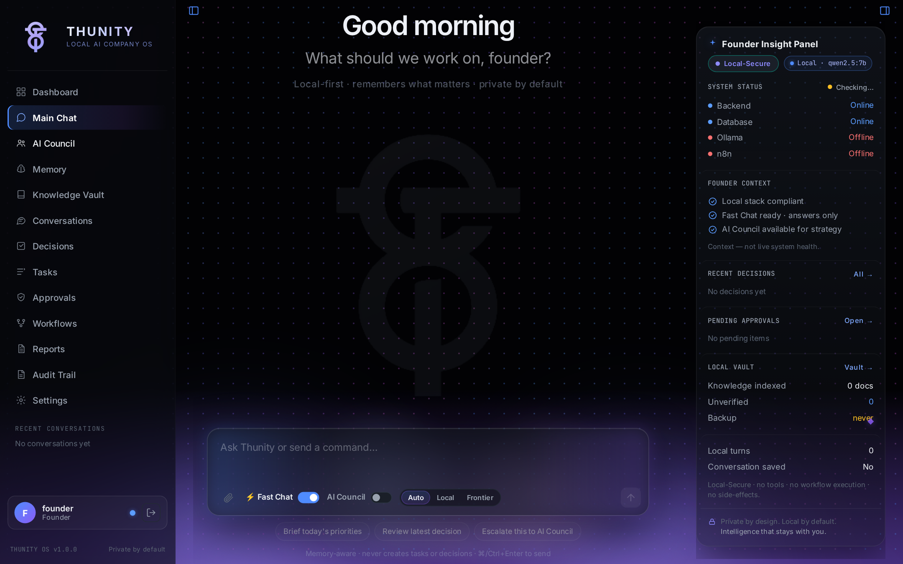
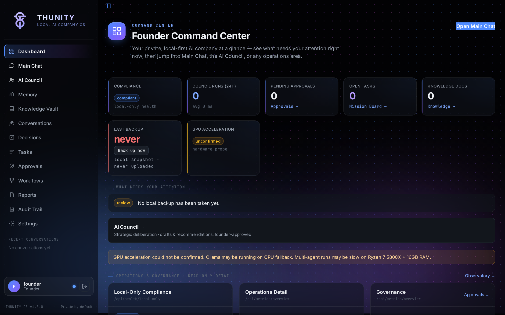
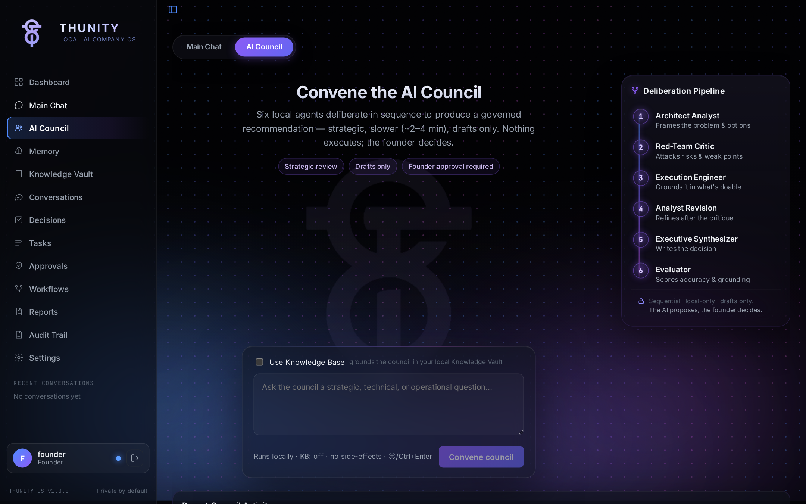
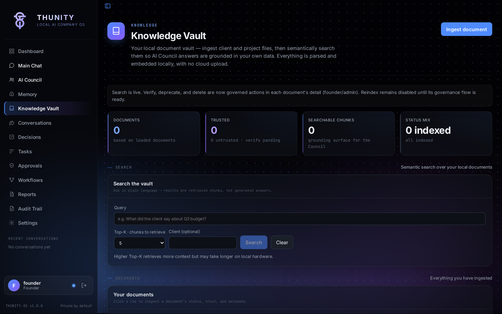
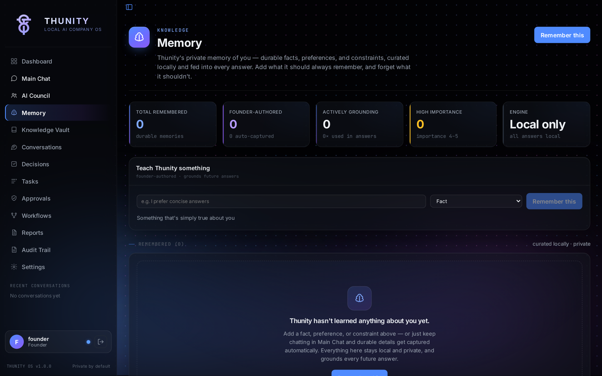
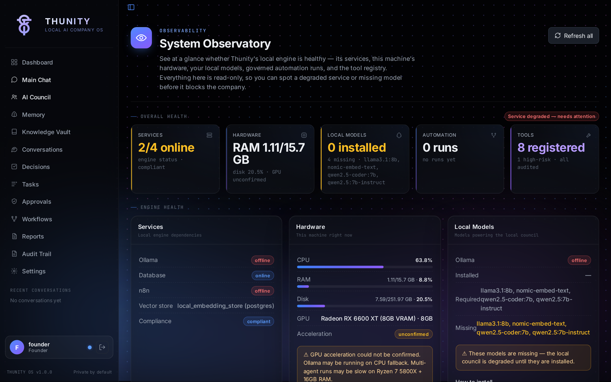
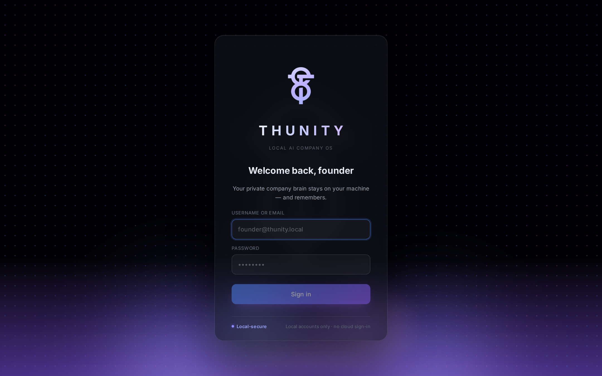

<div align="center">

# ◆ ThuAI — Thunity Personal Business Organization AI

### Your Personal AI. Your Own Database. Your Machine.

**A private, local-first AI Company OS** for decision-making, knowledge management,
task execution, and workflow governance — where **your company brain never leaves your computer**.

[](docs/LOCAL_ONLY_COMPLIANCE.md)
[](#-your-data-your-database)
[](#-honest-hybrid-ai)
[](backend/)
[](frontend/)
[](docker-compose.yml)

<br>



*Main Chat — local-first by default, with the Founder Insight Panel watching your whole company at a glance.*

</div>

---

## 🧠 What is ThuAI?

ThuAI is a **personal AI operating system** for running your business — not a chatbot,
not a SaaS subscription, not someone else's cloud. It's an entire AI company brain that
lives **on your own hardware**, with **your own database**, under **your full control**.

> 💡 **Core promise:** every document, decision, memory, embedding, and conversation
> is stored in a database **you own**, on a machine **you control**. No silent cloud
> calls. No data leaving your house without your explicit, labelled permission.

---

## ✨ What Makes It Special

### 🏛️ AI Council — six AI agents debate before you decide

Instead of one model giving one answer, ThuAI runs a **6-stage agent council** on every
strategic question:

```
 ① Architect Analyst      →  deep diagnosis & analysis
 ② Red Team Critic        →  adversarially attacks the analysis
 ③ Execution Engineer     →  "can we actually do this on our hardware?"
 ④ Architect (revision)   →  refines the analysis with all feedback
 ⑤ Executive Synthesizer  →  produces the final structured decision
 ⑥ Evaluator              →  scores the answer (accuracy, grounding, hallucination risk)
```

You get a decision that has already survived its own internal critics — with sources,
risk scores, and an audit trail.

### 🔒 Privacy by architecture, not by promise

- **`LOCAL_ONLY_MODE=true`** → every external call is **hard-blocked and audited** at the code level ([`backend/core/local_only.py`](backend/core/local_only.py))
- A static scanner ([`scripts/check-local-only.py`](scripts/check-local-only.py)) **fails the build** if any forbidden cloud dependency sneaks in
- Live compliance endpoint: `GET /api/health/local-only`
- Full posture documented in [`docs/LOCAL_ONLY_COMPLIANCE.md`](docs/LOCAL_ONLY_COMPLIANCE.md)

### 🗄️ Your Data, Your Database

Everything lives in **self-hosted PostgreSQL** running in your own Docker stack:

| Data | Where it lives |
|---|---|
| 📚 Documents & knowledge (RAG) | Your Postgres — chunks + embeddings, local cosine search |
| 🧬 Vector embeddings | Generated locally by Ollama `nomic-embed-text` — never sent out |
| 🧠 Founder memory (facts, people, projects) | Your Postgres |
| 💬 Conversations & council runs | Your Postgres |
| 📋 Decisions, tasks, approvals, audit log | Your Postgres |
| 💾 Backups | Local snapshots, one click from the dashboard |

No external vector DB. No embedding API. No telemetry.

### 🤝 Honest-Hybrid AI

Reasoning runs on **local Ollama models by default** (`qwen2.5`, `llama3.1`,
`qwen2.5-coder`). For heavy strategic work you *may* declare **one** frontier model
(Claude or OpenRouter) — and when it's used, it is **always labelled** to you.
No key configured? The system runs **100% local**. There is **never a silent cloud fallback**.

### 🎛️ Founder Command Center

A full React + TypeScript control room (Aurora design system) at `localhost:3000`:

**Dashboard** · **Council** · **Knowledge Vault** · **Decisions** · **Tasks** ·
**Approvals** · **Workflows (n8n)** · **Memory** · **Audit Trail** · **Observatory** ·
**Tools** · **Settings**

<table>
  <tr>
    <td align="center"><br><sub><b>Dashboard</b> — compliance, council runs, approvals, local backups</sub></td>
    <td align="center"><br><sub><b>AI Council</b> — the 6-stage deliberation pipeline</sub></td>
  </tr>
  <tr>
    <td align="center"><br><sub><b>Knowledge Vault</b> — local semantic search, no cloud upload</sub></td>
    <td align="center"><br><sub><b>Memory</b> — what ThuAI knows about you, local only</sub></td>
  </tr>
  <tr>
    <td align="center"><br><sub><b>Observatory</b> — services, hardware & model health</sub></td>
    <td align="center"><br><sub><b>Login</b> — your private company brain stays on your machine</sub></td>
  </tr>
</table>

### 🛡️ Governance built-in

- **Risk-scored decisions** (low → critical) with approval gates for high-risk actions
- **Allow-listed n8n workflows** — the AI can only trigger automation you've approved
- **Complete audit trail** of every decision, model call, and blocked external attempt
- **Founder memory** injected into every council stage, so the AI always knows *your* context

---

## 🏗️ Architecture

```
┌──────────────────────────── YOUR MACHINE ────────────────────────────┐
│                                                                      │
│  ┌──────────────┐   ┌──────────────────┐   ┌──────────────────────┐  │
│  │   Founder    │──▶│  FastAPI Backend │──▶│   Ollama (local AI)  │  │
│  │ Command Ctr  │   │  agents · RAG ·  │   │ qwen2.5 · llama3.1   │  │
│  │ React + Vite │   │  governance      │   │ nomic-embed-text     │  │
│  └──────────────┘   └────────┬─────────┘   └──────────────────────┘  │
│                              │                                       │
│         ┌────────────────────┼─────────────────────┐                 │
│         ▼                    ▼                     ▼                 │
│  ┌────────────┐      ┌────────────┐         ┌────────────┐           │
│  │ PostgreSQL │      │   Redis    │         │    n8n     │           │
│  │ YOUR data  │      │  sessions  │         │ workflows  │           │
│  │ + vectors  │      │  + cache   │         │ (governed) │           │
│  └────────────┘      └────────────┘         └────────────┘           │
│                                                                      │
└──── optional, declared & labelled: ──── Claude / OpenRouter ─────────┘
```

**Stack:** FastAPI · SQLAlchemy 2 (async) · PostgreSQL 15 · Redis 7 · Ollama ·
n8n · React 18 + TypeScript + Vite · Docker Compose (incl. AMD ROCm variant)

---

## 🚀 Quick Start

One command per machine. Full guides: [`docs/LOCAL_DEV_RUNBOOK.md`](docs/LOCAL_DEV_RUNBOOK.md) (Mac)
· [`docs/JOSHUA_LINUX_ROCM_RUNBOOK.md`](docs/JOSHUA_LINUX_ROCM_RUNBOOK.md) (Linux/AMD GPU).

```bash
# macOS — double-click scripts/start_thunity_mac.command, or:
bash scripts/start_thunity_mac.sh         # Docker services + frontend (host Ollama)

# Linux + AMD/ROCm:
bash scripts/start_thunity_linux_rocm.sh  # full stack incl. container Ollama (GPU)

# Health checks anytime (non-destructive):
bash scripts/dev_doctor.sh
bash scripts/check_thunity_health.sh
```

First run creates `.env` from `.env.example` and stops so you can set
`POSTGRES_PASSWORD`, `N8N_BASIC_AUTH_PASSWORD`, `SECRET_KEY`, `FOUNDER_PASSWORD`.

| Service | URL |
|---|---|
| 🎛️ Founder Command Center | http://localhost:3000 |
| 📖 API docs (OpenAPI) | http://localhost:8000/api/docs |
| 🔒 Local-only compliance | http://localhost:8000/api/health/local-only |
| ⚙️ n8n workflows | http://localhost:5678 |

<details>
<summary><b>🐳 Manual Docker setup</b></summary>

```bash
cp .env.example .env          # then edit: SECRET_KEY, POSTGRES_PASSWORD,
                              # N8N_BASIC_AUTH_PASSWORD, FOUNDER_PASSWORD

# Mac: use HOST Ollama (ollama serve), start everything except container Ollama:
docker compose up -d postgres redis n8n backend

# Linux/CPU container Ollama (opt-in via the 'ollama' profile):
docker compose --profile ollama up -d

# Pull the local models (never auto-pulled):
docker exec -it thunity-ollama ollama pull qwen2.5:7b-instruct
docker exec -it thunity-ollama ollama pull llama3.1:8b
docker exec -it thunity-ollama ollama pull qwen2.5-coder:7b
docker exec -it thunity-ollama ollama pull nomic-embed-text
```
</details>

<details>
<summary><b>🐍 Backend only (local Python, no Docker)</b></summary>

```bash
cd backend && pip install -r requirements.txt
export POSTGRES_URL="sqlite+aiosqlite:///./thunity.db"   # or a local postgres URL
export SECRET_KEY="$(openssl rand -hex 32)"
export FOUNDER_EMAIL="founder@thunity.local" FOUNDER_PASSWORD="strong-pass"
uvicorn main:app --reload
```
</details>

---

## 🧪 Testing & Compliance

```bash
cd backend && pytest -q                  # local sqlite db, Ollama mocked
python ../scripts/check-local-only.py    # fails if any forbidden cloud dependency is active
```

---

## 📂 Project Layout

```
backend/     FastAPI app — agents, RAG, governance, audit, memory
frontend/    Founder Command Center — React + TypeScript + Vite
scripts/     start/health/compliance scripts per platform
docs/        architecture, security, RAG, agent council, operating doctrine
references/  brand & visual reference sheets
```

> **Official workspace:** this repo is the **one official Thunity repo**.
> `PROJECT AI BUILDING` is references-only; `THUWEALTH AI` is a separate project.
> See [`docs/WORKSPACE_CONSOLIDATION.md`](docs/WORKSPACE_CONSOLIDATION.md).

---

<div align="center">

**◆ ThuAI** — *because your company's brain belongs to you.*

🔒 Local-first · 🗄️ Own database · 🏛️ AI council · 🛡️ Governed automation

</div>
